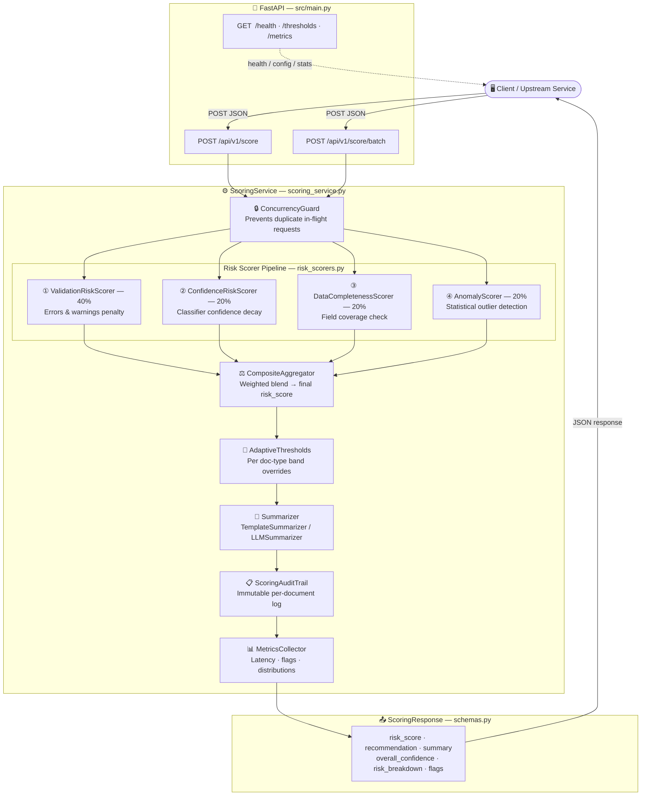
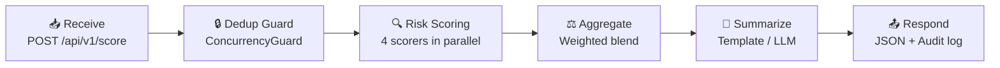
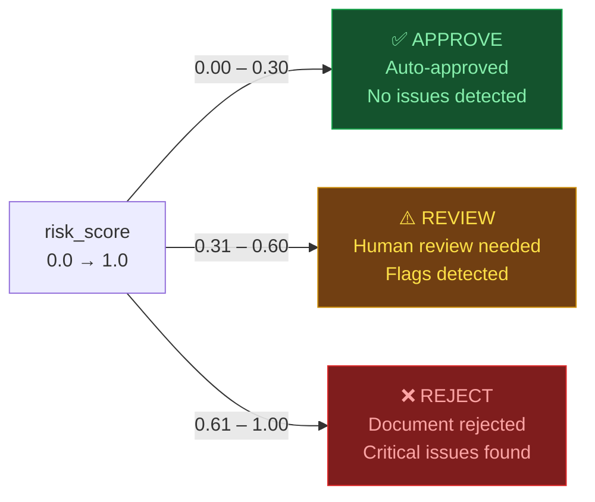

# 📄 Summary & Risk Scoring API

> Intelligent document processing pipeline — generates AI summaries, composite risk scores, and actionable recommendations for every incoming document.


---

## 📌 Overview

This API accepts structured documents (invoices, contracts, claims, etc.), runs them through a **4-stage risk scoring pipeline**, and returns:

- ✅ A natural-language **summary**
- 📊 A **risk score** (0.0 → 1.0)
- 🏷️ A **recommendation** — `approve` / `review` / `reject`
- 🔍 A detailed **risk breakdown** with flags

---

## 🏗️ Architecture



---

## 🔄 Document Processing Pipeline

Every document goes through the same **6-stage pipeline**:



---

## 🏷️ Recommendation Bands

The composite risk score maps to one of three decisions:



> **Note:** Thresholds auto-adjust per document type via `AdaptiveThresholds`.  
> Example — `claim` documents use stricter bands: approve ≤ 0.20, review ≤ 0.50.

---

## ⚖️ Risk Scorer Weights

| # | Scorer | Weight | What It Measures |
|---|--------|--------|-----------------|
| ① | `ValidationRiskScorer` | **40%** | Errors (×0.25 each) and warnings (×0.08 each) |
| ② | `ConfidenceRiskScorer` | **20%** | Exponential decay on upstream classifier confidence |
| ③ | `DataCompletenessScorer` | **20%** | Missing or sparse fields in `standardized_data` |
| ④ | `AnomalyScorer` | **20%** | Statistical outliers in numeric fields |

---

## 📡 API Endpoints

| Method | Endpoint | Description |
|--------|----------|-------------|
| `POST` | `/api/v1/score` | Score a single document — returns summary, risk score & recommendation |
| `POST` | `/api/v1/score/batch` | Score up to 50 documents in one call with batch-level summary |
| `GET`  | `/api/v1/thresholds` | View current risk & confidence threshold configuration |
| `GET`  | `/api/v1/metrics` | Live snapshot — latency, flag distribution, recommendation counts |
| `GET`  | `/health` | Service health check and model readiness status |

---

## 📥 Request & Response Examples

### Request Body — `POST /api/v1/score`

```json
{
  "document_id": "DOC001",
  "standardized_data": {
    "type": "invoice",
    "amount": 1250.00,
    "currency": "USD",
    "vendor": "Acme Corp",
    "date": "2025-03-15",
    "line_items": 3
  },
  "validation_result": {
    "is_valid": true,
    "errors": [],
    "warnings": [],
    "field_coverage": 0.95
  },
  "classification_confidence": 0.94
}
```

### Response — `200 OK`

```json
{
  "document_id": "DOC001",
  "summary": "Invoice DOC001 processed successfully. No significant issues detected.",
  "risk_score": 0.12,
  "overall_confidence": 0.95,
  "recommendation": "approve",
  "risk_breakdown": {
    "validation_risk": 0.00,
    "confidence_risk": 0.06,
    "data_completeness_risk": 0.05,
    "anomaly_risk": 0.01
  },
  "flags": [],
  "processed_at": "2025-03-15T12:00:00Z"
}
```

---

## 🗂️ Project Structure

```
W7 PJ/
├── main.py                    # Entry point — starts the server
├── requirements.txt           # Python dependencies
├── pyproject.toml             # Build & test configuration
├── config/
│   └── .env.example           # Copy to .env and fill API keys
├── data/
│   ├── act.json               # Sample single document input
│   └── batch_input.csv        # Sample batch input
├── src/
│   ├── main.py                # FastAPI routes & app setup
│   ├── scoring_service.py     # ⭐ Pipeline orchestrator
│   ├── risk_scorers.py        # ⭐ 4 scorer modules
│   ├── summarizer.py          # Template + LLM summarizer
│   ├── schemas.py             # Pydantic request/response models
│   ├── config.py              # App configuration
│   ├── logger.py              # Logging setup
│   ├── LLM.py                 # Claude API integration
│   ├── io_handler.py          # I/O handling utilities
│   ├── app.py                 # App factory helpers
│   ├── models/                # Data model definitions
│   ├── services/              # Service layer (analysis, base)
│   └── utils/                 # File operations & helpers
└── tests/
    ├── conftest.py            # Pytest fixtures
    └── test_api.py            # API endpoint tests
```

---

## 🚀 Quick Start

### 1 · Clone & Install

```bash
# Clone and enter the project
git clone <repo-url>
cd "W7 PJ"

# Create virtual environment
python -m venv .venv

# Activate (Windows)
.venv\Scripts\activate

# Activate (macOS / Linux)
source .venv/bin/activate

# Install dependencies
pip install -r requirements.txt
```

### 2 · Configure Environment

```bash
cp config/.env.example .env
# Open .env and set your ANTHROPIC_API_KEY
```

### 3 · Run the Server

```bash
python main.py
# API  →  http://127.0.0.1:8000
# Docs →  http://127.0.0.1:8000/docs
```

---

## 🔑 Environment Variables

| Variable | Required | Description |
|----------|----------|-------------|
| `ANTHROPIC_API_KEY` | Yes (for LLM) | Claude API key for `LLMSummarizer` |
| `DEBUG` | No | Enable debug mode (`True` / `False`) |
| `LOG_LEVEL` | No | Logging level (`INFO`, `DEBUG`, `WARNING`) |

---

## 🧪 Running Tests

```bash
pytest tests/ -v
```

---

## 📊 Observability

The `/api/v1/metrics` endpoint returns a live snapshot:

| Metric | Description |
|--------|-------------|
| `total_scored` | Total documents processed since startup |
| `recommendation_distribution` | Approve / review / reject counts |
| `avg_latency_ms` | Average scoring time in milliseconds |
| `max_latency_ms` | Peak scoring time in milliseconds |
| `top_flags` | Most frequent risk flag categories |

---

## 🛠️ Tech Stack

| Layer | Technology | Version |
|-------|-----------|---------|
| Web Framework | [FastAPI](https://fastapi.tiangolo.com/) | 0.128.8 |
| ASGI Server | [Uvicorn](https://www.uvicorn.org/) | 0.30.6 |
| Data Validation | [Pydantic](https://docs.pydantic.dev/) | 2.8.2 |
| LLM Integration | [Anthropic Claude](https://www.anthropic.com/) | Latest |
| HTTP Client | [HTTPX](https://www.python-httpx.org/) | 0.27.2 |
| Testing | Pytest + pytest-asyncio | 8.3.2 |

---

## 📄 License

MIT License — see `LICENSE` for details.

---

*Summary & Risk Scoring API · v1.0.0 · Built with FastAPI & Claude*
